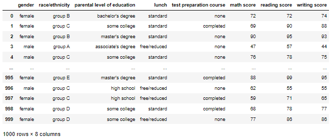
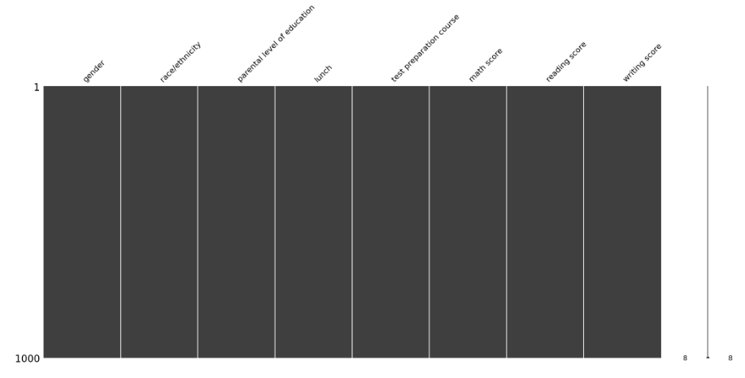
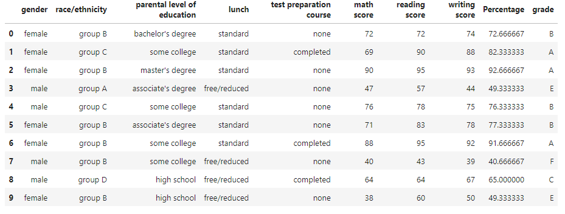
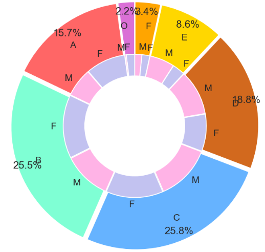

## Student Academic Performance Analysis 📚📈  

<!-- TABLE OF CONTENTS -->

  
Table of Contents

  <ol>
    <li>
      <a href="#about-the-project">Introduction</a>
      <ul>
        <li><a href="#built-with">Why is it important to analyze student performance?</a></li>
      </ul>
     </li>
     <li>
      <a href="#getting-started">Loading libraries and data</a>
      <ul> </ul>
    </li>
    <li>
      <a href="#getting-started">Quick look at the data</a>
    </li>
    <ul>
        <li><a href="#built-with">Data</a></li>
      </ul>
      <ul>
        <li><a href="#built-with">Attribute Information</a></li>
      </ul>
    <li>
      <a href="#getting-started">Visualize missing values</a>
    </li>
     <li>
      <a href="#getting-started">Data Preparation</a>
    </li>
    <ul>
        <li><a href="#built-with">Creating new columns</a></li>
      </ul>
      <ul>
        <li><a href="#built-with">Grading System</a></li>
      </ul>
    <li>
      <a href="#getting-started">Data Visualization</a>
    </li>
    

<!-- ABOUT THE PROJECT -->
## :star2: About The Project
This data set consists of the marks secured by the students in various subjects.
Let's try to understand the influence of the parents background, test preparation etc on students performance.

## :interrobang: Why is it important to analyze student performance?

Analyzing student work is an essential part of teaching. Teachers assign, collect and examine student work all the 
time to assess student learning and to revise and improve teaching. Ongoing assessment of student learning allows 
teachers to engage in continuous quality improvement of their courses. Many factors can influence a student's performance,
including the influence of the parents' educational background, test preparation, student health, and so on.

## :gear: Loading libraries and data

<li> import numpy as np </li>
<li> import matplotlib.pyplot as plt </li>
<li> import seaborn as sns 
<li>import missingno as msno

## :eyes: Quick look at the data
  In this section we just look at the data using some commands 
    

  
## :zap: Visualize missing values
  

Using matrix can very quickly find the pattern of missingness in the dataset. 
  From the above visualisation we can observe that no peculiar pattern can be found!
  There are no missing values in our dataset!
  
## :white_check_mark: Data Preparation
  ==> For a particular course, the total marks is 100. So let's set passmark has 35 marks.
  
  Let's create three new columns: Total_Marks, Percentage and grade
      

  
  
  
## :hammer_and_wrench: Data Visualization 
  

  
  From the above visualization we infer:

The majority of students who earned an O grade were female.
Majority of students received B grade followed by C.
More female students received A and B Grade relative to male students.
More number of boys received D and E grade.
Almost similar number of both, male and female, got F grade.

## :hourglass_flowing_sand: Conclusion
Academic Performance is the outcome of education. It is the level of educational goals a person has achieved. To pursuing of academic performance satisfies an amount of purposes. Students have spots of failure and achievement in their academic career and this has to be assessed in order to promote improvement and make use of educational development. In educational institutions, success is measured by academic performance. 

